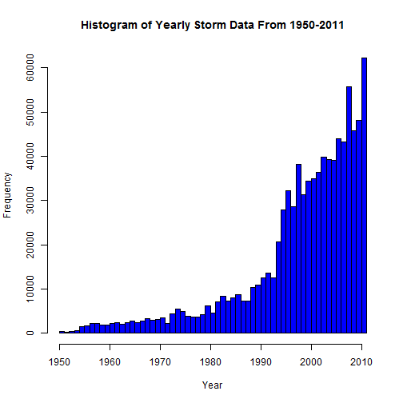
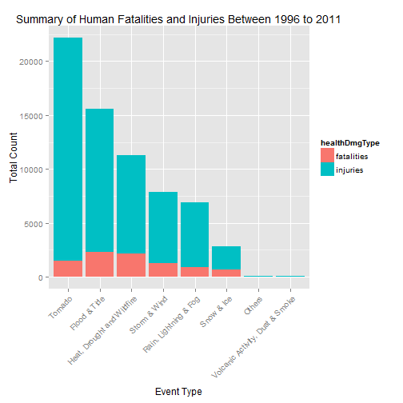
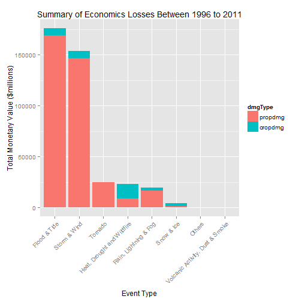

This is an R Markdown document. Markdown is a simple formatting syntax for authoring HTML, PDF, and MS Word documents. For more details on using R Markdown see <http://rmarkdown.rstudio.com>.

## Introduction
This assignment is to explore the NOAA Storm Database and answer some basic questions about severe weather events. There are 2 questions to be answered using the database and show the codes for the entire analysis. The analysis should consist of tables, figures, or other summaries. Any R package can be used to support this analysis.  
  
The events in the database start in the year 1950 and end in November 2011. In the earlier years of the database there are generally fewer events recorded, most likely due to a lack of good records. More recent years should be considered more complete.  

## Questions
This data analysis must address the following 2 questions:  
      1. Across the United States, which types of events (EVTYPE) are most harmful with respect to population health?  
      2. Across the United Sates. which types of events (EVTYPE) have the greatest economics consequences?  

## Title
"Tornado" and "Flood & Tide" are the top 2 weather related events threaten human life and health.  
"Flood & Tide" and "Storm & Wind" are the top 2 weather related events causes the most economic losses. 

From individual fatalities vs injuries aspect, Tornado causes the most injuries while Flood and Tide related events cause most dealth than other events.  

"Heat, Drought and Wildfire" is the #1 cause of crop damanage loss. But Flood & Tide related events cause the most property damage loss.  

## Synopsis
Based on the analysis, the most harmdul weather related event threatens population health is TORNADO; The most harmful weather related event causes the economic losses is Flood & Tide related.  

## Data Processing
Loading the required libraries

```r
library(R.utils)    ## for bumzip2() to unzip the downloaded datafile
library(ggplot2)    ## for plotting functions
library(dplyr)      ## for data cleaning and manipulation
library(reshape2)   ## for reshaping data frame for plotting
```


Loading and preprocessing the data file

```r
## unzip the data downloaded datafile
if (!file.exists("./repdata_data_StormData.csv")) {
   bunzip2("repdata_data_StormData.csv.bz2", "repdata_data_StormData.csv", remove = FALSE, skip = TRUE)
}

## read csv file to data frame
## stromhAsFators=FALSE helps when processing exp values
stormData <- read.csv("repdata_data_StormData.csv", header=TRUE, stringsAsFactors=FALSE)
```

Peeking the data

```r
head(stormData)
```

```
##   STATE__           BGN_DATE BGN_TIME TIME_ZONE COUNTY COUNTYNAME STATE
## 1       1  4/18/1950 0:00:00     0130       CST     97     MOBILE    AL
## 2       1  4/18/1950 0:00:00     0145       CST      3    BALDWIN    AL
## 3       1  2/20/1951 0:00:00     1600       CST     57    FAYETTE    AL
## 4       1   6/8/1951 0:00:00     0900       CST     89    MADISON    AL
## 5       1 11/15/1951 0:00:00     1500       CST     43    CULLMAN    AL
## 6       1 11/15/1951 0:00:00     2000       CST     77 LAUDERDALE    AL
##    EVTYPE BGN_RANGE BGN_AZI BGN_LOCATI END_DATE END_TIME COUNTY_END
## 1 TORNADO         0                                               0
## 2 TORNADO         0                                               0
## 3 TORNADO         0                                               0
## 4 TORNADO         0                                               0
## 5 TORNADO         0                                               0
## 6 TORNADO         0                                               0
##   COUNTYENDN END_RANGE END_AZI END_LOCATI LENGTH WIDTH F MAG FATALITIES
## 1         NA         0                      14.0   100 3   0          0
## 2         NA         0                       2.0   150 2   0          0
## 3         NA         0                       0.1   123 2   0          0
## 4         NA         0                       0.0   100 2   0          0
## 5         NA         0                       0.0   150 2   0          0
## 6         NA         0                       1.5   177 2   0          0
##   INJURIES PROPDMG PROPDMGEXP CROPDMG CROPDMGEXP WFO STATEOFFIC ZONENAMES
## 1       15    25.0          K       0                                    
## 2        0     2.5          K       0                                    
## 3        2    25.0          K       0                                    
## 4        2     2.5          K       0                                    
## 5        2     2.5          K       0                                    
## 6        6     2.5          K       0                                    
##   LATITUDE LONGITUDE LATITUDE_E LONGITUDE_ REMARKS REFNUM
## 1     3040      8812       3051       8806              1
## 2     3042      8755          0          0              2
## 3     3340      8742          0          0              3
## 4     3458      8626          0          0              4
## 5     3412      8642          0          0              5
## 6     3450      8748          0          0              6
```

```r
str(stormData)
```

```
## 'data.frame':	902297 obs. of  37 variables:
##  $ STATE__   : num  1 1 1 1 1 1 1 1 1 1 ...
##  $ BGN_DATE  : chr  "4/18/1950 0:00:00" "4/18/1950 0:00:00" "2/20/1951 0:00:00" "6/8/1951 0:00:00" ...
##  $ BGN_TIME  : chr  "0130" "0145" "1600" "0900" ...
##  $ TIME_ZONE : chr  "CST" "CST" "CST" "CST" ...
##  $ COUNTY    : num  97 3 57 89 43 77 9 123 125 57 ...
##  $ COUNTYNAME: chr  "MOBILE" "BALDWIN" "FAYETTE" "MADISON" ...
##  $ STATE     : chr  "AL" "AL" "AL" "AL" ...
##  $ EVTYPE    : chr  "TORNADO" "TORNADO" "TORNADO" "TORNADO" ...
##  $ BGN_RANGE : num  0 0 0 0 0 0 0 0 0 0 ...
##  $ BGN_AZI   : chr  "" "" "" "" ...
##  $ BGN_LOCATI: chr  "" "" "" "" ...
##  $ END_DATE  : chr  "" "" "" "" ...
##  $ END_TIME  : chr  "" "" "" "" ...
##  $ COUNTY_END: num  0 0 0 0 0 0 0 0 0 0 ...
##  $ COUNTYENDN: logi  NA NA NA NA NA NA ...
##  $ END_RANGE : num  0 0 0 0 0 0 0 0 0 0 ...
##  $ END_AZI   : chr  "" "" "" "" ...
##  $ END_LOCATI: chr  "" "" "" "" ...
##  $ LENGTH    : num  14 2 0.1 0 0 1.5 1.5 0 3.3 2.3 ...
##  $ WIDTH     : num  100 150 123 100 150 177 33 33 100 100 ...
##  $ F         : int  3 2 2 2 2 2 2 1 3 3 ...
##  $ MAG       : num  0 0 0 0 0 0 0 0 0 0 ...
##  $ FATALITIES: num  0 0 0 0 0 0 0 0 1 0 ...
##  $ INJURIES  : num  15 0 2 2 2 6 1 0 14 0 ...
##  $ PROPDMG   : num  25 2.5 25 2.5 2.5 2.5 2.5 2.5 25 25 ...
##  $ PROPDMGEXP: chr  "K" "K" "K" "K" ...
##  $ CROPDMG   : num  0 0 0 0 0 0 0 0 0 0 ...
##  $ CROPDMGEXP: chr  "" "" "" "" ...
##  $ WFO       : chr  "" "" "" "" ...
##  $ STATEOFFIC: chr  "" "" "" "" ...
##  $ ZONENAMES : chr  "" "" "" "" ...
##  $ LATITUDE  : num  3040 3042 3340 3458 3412 ...
##  $ LONGITUDE : num  8812 8755 8742 8626 8642 ...
##  $ LATITUDE_E: num  3051 0 0 0 0 ...
##  $ LONGITUDE_: num  8806 0 0 0 0 ...
##  $ REMARKS   : chr  "" "" "" "" ...
##  $ REFNUM    : num  1 2 3 4 5 6 7 8 9 10 ...
```

```r
names(stormData)
```

```
##  [1] "STATE__"    "BGN_DATE"   "BGN_TIME"   "TIME_ZONE"  "COUNTY"    
##  [6] "COUNTYNAME" "STATE"      "EVTYPE"     "BGN_RANGE"  "BGN_AZI"   
## [11] "BGN_LOCATI" "END_DATE"   "END_TIME"   "COUNTY_END" "COUNTYENDN"
## [16] "END_RANGE"  "END_AZI"    "END_LOCATI" "LENGTH"     "WIDTH"     
## [21] "F"          "MAG"        "FATALITIES" "INJURIES"   "PROPDMG"   
## [26] "PROPDMGEXP" "CROPDMG"    "CROPDMGEXP" "WFO"        "STATEOFFIC"
## [31] "ZONENAMES"  "LATITUDE"   "LONGITUDE"  "LATITUDE_E" "LONGITUDE_"
## [36] "REMARKS"    "REFNUM"
```

```r
noOfObs <- nrow(stormData)
noOfVars <- ncol(stormData)
```

This dataset has 902297 observations/rows and 37 variables/columns.  

The required data for analysis in order to answer the 2 questions are:  
&nbsp;&nbsp;&nbsp;&nbsp;* BGN_DATE  
&nbsp;&nbsp;&nbsp;&nbsp;* EVTYPE  
&nbsp;&nbsp;&nbsp;&nbsp;* FATALITIES  
&nbsp;&nbsp;&nbsp;&nbsp;* INJURIES  
&nbsp;&nbsp;&nbsp;&nbsp;* PROPDMG  
&nbsp;&nbsp;&nbsp;&nbsp;* PROPDMGEXP  
&nbsp;&nbsp;&nbsp;&nbsp;* CROPDMG  
&nbsp;&nbsp;&nbsp;&nbsp;* CROPDMGEXP  


```r
## Select the required columns for analysis
stormColsData <- stormData[, c("BGN_DATE","EVTYPE","FATALITIES","INJURIES","PROPDMG","PROPDMGEXP","CROPDMG","CROPDMGEXP")]
```

Processing the data to proper format to be analyzed.

```r
## Convert BGN_DATE to Date class so we can use date related functions
stormColsData$BGN_DATE <- as.Date(stormColsData$BGN_DATE, "%m/%d/%Y %H:%M:%S")

## All observations are measured between 1950 to 2011. 
## In the early years, there were fewer events which could screw the data. 
## We want to take a look at the data distribution per year and determine 
## the best data set to use for analysis.
stormColsData$YEAR <- as.numeric(format(stormColsData$BGN_DATE, "%Y"))

## Rename columns to easier typing
colnames(stormColsData) <- c("bgndate","evtype","fatalities","injuries","propdmg","propdmgexp","cropdmg","cropdmgexp","year")

str(stormColsData)
```

```
## 'data.frame':	902297 obs. of  9 variables:
##  $ bgndate   : Date, format: "1950-04-18" "1950-04-18" ...
##  $ evtype    : chr  "TORNADO" "TORNADO" "TORNADO" "TORNADO" ...
##  $ fatalities: num  0 0 0 0 0 0 0 0 1 0 ...
##  $ injuries  : num  15 0 2 2 2 6 1 0 14 0 ...
##  $ propdmg   : num  25 2.5 25 2.5 2.5 2.5 2.5 2.5 25 25 ...
##  $ propdmgexp: chr  "K" "K" "K" "K" ...
##  $ cropdmg   : num  0 0 0 0 0 0 0 0 0 0 ...
##  $ cropdmgexp: chr  "" "" "" "" ...
##  $ year      : num  1950 1950 1951 1951 1951 ...
```

```r
unique(stormColsData$propdmgexp)
```

```
##  [1] "K" "M" ""  "B" "m" "+" "0" "5" "6" "?" "4" "2" "3" "h" "7" "H" "-"
## [18] "1" "8"
```

```r
unique(stormColsData$cropdmgexp)
```

```
## [1] ""  "M" "K" "m" "B" "?" "0" "k" "2"
```

Should we ignore the data from the early years? If yes, What is the cut-off year?  
Let's explore the data distribution by plotting the histogram by year.  

```r
## Data distribution by year
hist(stormColsData$year, col="blue", main="Histogram of Yearly Storm Data From 1950-2011", xlab="Year", breaks=50)
```

 

Based on the histgram, after 1995, more data are collected. We will use 1995 as cut-off year.  
Data collected before 1995 will be ignored.

```r
## Filter the data greater than year 1995
subsetStormData <- stormColsData[stormColsData$year > 1995, ]
str(subsetStormData)
```

```
## 'data.frame':	653530 obs. of  9 variables:
##  $ bgndate   : Date, format: "1996-01-06" "1996-01-11" ...
##  $ evtype    : chr  "WINTER STORM" "TORNADO" "TSTM WIND" "TSTM WIND" ...
##  $ fatalities: num  0 0 0 0 0 0 0 0 0 0 ...
##  $ injuries  : num  0 0 0 0 0 0 0 0 0 0 ...
##  $ propdmg   : num  380 100 3 5 2 0 400 12 8 12 ...
##  $ propdmgexp: chr  "K" "K" "K" "K" ...
##  $ cropdmg   : num  38 0 0 0 0 0 0 0 0 0 ...
##  $ cropdmgexp: chr  "K" "" "" "" ...
##  $ year      : num  1996 1996 1996 1996 1996 ...
```

```r
unique(subsetStormData$propdmgexp)
```

```
## [1] "K" ""  "M" "B" "0"
```

```r
unique(subsetStormData$cropdmgexp)
```

```
## [1] "K" ""  "M" "B"
```

### Across the United States, which types of events (as indicated in the EVTYPE variable) are most harmful with respect to population health?

By looking at the data, there are couple observations -  
&nbsp;&nbsp;&nbsp;&nbsp;* evtype has 985 different values, which need to be clean up/consolidated to reduce to 48 or fewer meaningful categories(event types)  
&nbsp;&nbsp;&nbsp;&nbsp;* 2 varaibles are related to population health: fatalities and injuries. 
In order to answer the questions, we will need to explore the data to understand how each evtype impacts fatalities and/or inquiries.  
&nbsp;&nbsp;&nbsp;&nbsp;* economics consequences are measured with both property damage and crop damge but the cost of damage is presented in various unit (numberic, k/K, m/M, b/B). This unit needs to be clean up in order to get the proper sum.  
  
First, let's clean up the evtype, but how?  
&nbsp;&nbsp;&nbsp;&nbsp;1. We have now 985 unique event type, some have 0 falities and injuries, as well as 0 cropdmg and propdmg. Since these events have no impact to health nor economics, We can try to remove these event types to see if we got a smaller set of event type to clean.

```r
## Reduce data by removing zero health impact data
x <- subsetStormData[(subsetStormData$fatalities==0 | subsetStormData$injuries==0), ]
str(x)
```

```
## 'data.frame':	652145 obs. of  9 variables:
##  $ bgndate   : Date, format: "1996-01-06" "1996-01-11" ...
##  $ evtype    : chr  "WINTER STORM" "TORNADO" "TSTM WIND" "TSTM WIND" ...
##  $ fatalities: num  0 0 0 0 0 0 0 0 0 0 ...
##  $ injuries  : num  0 0 0 0 0 0 0 0 0 0 ...
##  $ propdmg   : num  380 100 3 5 2 0 400 12 8 12 ...
##  $ propdmgexp: chr  "K" "K" "K" "K" ...
##  $ cropdmg   : num  38 0 0 0 0 0 0 0 0 0 ...
##  $ cropdmgexp: chr  "K" "" "" "" ...
##  $ year      : num  1996 1996 1996 1996 1996 ...
```

```r
rm(x)
```
The result of this approach does not reduce the number of event types so it does not worth too much efforts to reduce the data with this approach.  

&nbsp;&nbsp;&nbsp;&nbsp;2. Next, by reading NWSI 10-1605 pdf file, where section 7 list 48 major event types, We will consolidate event types.  
Let's do some data exploration to find out the top 20 health impact events. 

```r
## By total of fatalities and injuries
stormDataByEvt <- aggregate(fatalities+injuries~evtype, data=subsetStormData, sum)
colnames(stormDataByEvt) <- c("evtype", "total")

## sort the total in descending order and only get the top 20 events
head(arrange(stormDataByEvt, desc(total)), n=20)
```

```
##               evtype total
## 1            TORNADO 22178
## 2     EXCESSIVE HEAT  8188
## 3              FLOOD  7172
## 4          LIGHTNING  4792
## 5          TSTM WIND  3870
## 6        FLASH FLOOD  2561
## 7  THUNDERSTORM WIND  1530
## 8       WINTER STORM  1483
## 9               HEAT  1459
## 10 HURRICANE/TYPHOON  1339
## 11         HIGH WIND  1318
## 12          WILDFIRE   986
## 13        HEAVY SNOW   805
## 14               FOG   772
## 15              HAIL   720
## 16  WILD/FOREST FIRE   557
## 17       RIP CURRENT   549
## 18      RIP CURRENTS   496
## 19          BLIZZARD   455
## 20         ICE STORM   400
```

Here is the plan to merged 985 events to 8 -  
&nbsp;&nbsp;&nbsp;&nbsp;* TORNADO: Tornado, funnel wind, water spout, etc.  
&nbsp;&nbsp;&nbsp;&nbsp;* FLOOD & Tide: Tsunami, flood, tide, etc.  
&nbsp;&nbsp;&nbsp;&nbsp;* HEAT, DROUGHT & WILDFIRE: Excessive heat, hot, wildfire, etc.  
&nbsp;&nbsp;&nbsp;&nbsp;* STORM & WIND: wind, gusty wind, storm, thunderstorm, typhoon, hurricane, etc.  
&nbsp;&nbsp;&nbsp;&nbsp;* SNOW & ICE: Winter Storm, Heavy Snow, Blizzard, Cold, CHill, sleet, etc.  
&nbsp;&nbsp;&nbsp;&nbsp;* RAIN, LIGHTNING & FOG: Fog, rain, hail, precipitation, lightning, etc.  
&nbsp;&nbsp;&nbsp;&nbsp;* VOLCANIC ACTIVITY & SMOKE: earthquake, Dust storm, dense smoke, volcanic ash, etc.  
&nbsp;&nbsp;&nbsp;&nbsp;* OTHERS  

```r
## Start to reduce the event types to 8 big categories. Some might be counted into more than one category.
subsetStormData$evtype[grepl("tornado|funnel|spout", subsetStormData$evtype, ignore.case=TRUE)] <- "Tornado"
subsetStormData$evtype[grepl("flood|tide|surf|tsunami|current|tstm|fld|dam break|high seas|high water|high seas|heavy seas|drowning|wave|rough seas", subsetStormData$evtype, ignore.case=TRUE)] <- "Flood & Tide"
subsetStormData$evtype[grepl("heat|drought|fire|warm|warmth|dry|hot|record high|record temperature|temperature record|driest", subsetStormData$evtype, ignore.case=TRUE)] <- "Heat, Drought and Wildfire"
subsetStormData$evtype[grepl("wind|storm|typhoon|hurricane|wnd", subsetStormData$evtype, ignore.case=TRUE)] <- "Storm & Wind"
subsetStormData$evtype[grepl("snow|blizzard|ice|icy|winter|sleet|freeze|frost|chill|glaze|avalanche|cold|cool|wintry", subsetStormData$evtype, ignore.case=TRUE)] <- "Snow & Ice"
subsetStormData$evtype[grepl("rain|lightning|fog|precipitation|hail|drizzle|wet|mud|landslump|slide", subsetStormData$evtype, ignore.case=TRUE)] <- "Rain, Lightning & Fog"
subsetStormData$evtype[grepl("volcanic|dust|smoke|swells", subsetStormData$evtype, ignore.case=TRUE)] <- "Volcanic Activity, Dust & Smoke"
subsetStormData$evtype[!grepl("tornado|flood|heat|storm|snow|rain|volcanic", subsetStormData$evtype, ignore.case=TRUE)] <- "Others"

unique(subsetStormData$evtype)
```

```
## [1] "Storm & Wind"                    "Tornado"                        
## [3] "Flood & Tide"                    "Rain, Lightning & Fog"          
## [5] "Snow & Ice"                      "Heat, Drought and Wildfire"     
## [7] "Others"                          "Volcanic Activity, Dust & Smoke"
```

```r
sum(subsetStormData$evtype=="Others")
```

```
## [1] 252
```
Now we have 8 event type categories and Others/Misc has few hundreds records only so it will not impact our conclusion of the events with the most impacts to health and economy loss.

Next, unify economic impacts by calculating the cost of property and crop damage in unit of $1

```r
## Convert unit such as h, m, B to unit of 10
## Leave numeric exp as it is
## Ignore/remove invalid data such as ""," ",","-","?","+", other special characters
subsetStormData$propdmgexp[grepl("h|H", subsetStormData$propdmgexp, ignore.case=TRUE)] <- "2"
subsetStormData$propdmgexp[grepl("k|K", subsetStormData$propdmgexp, ignore.case=TRUE)] <- "3"
subsetStormData$propdmgexp[grepl("m|M", subsetStormData$propdmgexp, ignore.case=TRUE)] <- "6"
subsetStormData$propdmgexp[grepl("b|B", subsetStormData$propdmgexp, ignore.case=TRUE)] <- "9"
subsetStormData$propdmgexp[grepl("^$| |\\,|\\-|\\+|\\?", subsetStormData$propdmgexp, ignore.case=TRUE)] <- "0"
subsetStormData$propdmgexp <- as.numeric(subsetStormData$propdmgexp)

## Apply the same converstion to cropdmgexp
subsetStormData$cropdmgexp[grepl("h|H", subsetStormData$cropdmgexp, ignore.case=TRUE)] <- "2"
subsetStormData$cropdmgexp[grepl("k|K", subsetStormData$cropdmgexp, ignore.case=TRUE)] <- "3"
subsetStormData$cropdmgexp[grepl("m|M", subsetStormData$cropdmgexp, ignore.case=TRUE)] <- "6"
subsetStormData$cropdmgexp[grepl("b|B", subsetStormData$cropdmgexp, ignore.case=TRUE)] <- "9"
subsetStormData$cropdmgexp[grepl("^$| |\\,|\\-|\\+|\\?", subsetStormData$cropdmgexp, ignore.case=TRUE)] <- "0"
subsetStormData$cropdmgexp <- as.numeric(subsetStormData$cropdmgexp)


## Calculate the propdmg and cropdmg with proper unit
subsetStormData$propdmg <- subsetStormData$propdmg * (10 ^ subsetStormData$propdmgexp)
subsetStormData$cropdmg <- subsetStormData$cropdmg * (10 ^ subsetStormData$cropdmgexp)
```

Here is the final data set we will use to answer the 2 questions.

```r
## Select the columns we need for final analysis/plot
finalStormData <- subsetStormData[, c("year","evtype","fatalities","injuries","propdmg","cropdmg")]
```


Sum up the fatalities and Injuries counts to get which event types impact population health most; And sum up property and crop damage monetary values to know which event has most economics consequences.

```r
## By total of fatalities and injuries
## totalImpHealthByEvt <- aggregate(cbind(fatalities,injuries,fatalities+injuries)~evtype, data=finalStormData, sum)

aggrStormData <- finalStormData %>% group_by(evtype) %>% summarise_each(funs(sum),-year) %>% mutate(totalHealthImp=fatalities+injuries, totalAmount=propdmg+cropdmg)

## sort the total in descending order
healthDataByEvt <- arrange(aggrStormData[, c("evtype","fatalities","injuries","totalHealthImp")], desc(totalHealthImp))
dmgAmountDataByEvt <- arrange(aggrStormData[, c("evtype","propdmg","cropdmg","totalAmount")], desc(totalAmount))

healthDataByEvt
```

```
## Source: local data frame [8 x 4]
## 
##                            evtype fatalities injuries totalHealthImp
##                             (chr)      (dbl)    (dbl)          (dbl)
## 1                         Tornado       1513    20670          22183
## 2                    Flood & Tide       2340    13218          15558
## 3      Heat, Drought and Wildfire       2126     9119          11245
## 4                    Storm & Wind       1235     6667           7902
## 5           Rain, Lightning & Fog        868     6021           6889
## 6                      Snow & Ice        635     2209           2844
## 7                          Others         12       32             44
## 8 Volcanic Activity, Dust & Smoke          3       39             42
```

```r
dmgAmountDataByEvt
```

```
## Source: local data frame [8 x 4]
## 
##                            evtype      propdmg     cropdmg  totalAmount
##                             (chr)        (dbl)       (dbl)        (dbl)
## 1                    Flood & Tide 169208254610  6969044800 176177299410
## 2                    Storm & Wind 146561001900  7173583600 153734585500
## 3                         Tornado  24622817010   283425010  24906242020
## 4      Heat, Drought and Wildfire   8817526800 14262424630  23079951430
## 5           Rain, Lightning & Fog  16274740540  3262157690  19536898230
## 6                      Snow & Ice   1278275390  2801058600   4079333990
## 7                          Others      3710500     1034400      4744900
## 8 Volcanic Activity, Dust & Smoke      1288630           0      1288630
```


## Results
### Across the United States, which types of events (EVTYPE) are most harmful with respect to population health?
Plot the bar chart to show the impact of population health per event types

```r
meltHealthData <- melt(healthDataByEvt[c("evtype","fatalities","injuries")], id.vars=c("evtype"))
colnames(meltHealthData) <- c("evtype","healthDmgType","count")

ggplot(meltHealthData, aes(x=reorder(factor(evtype), -count), y=count)) +
     geom_bar(stat="identity", aes(fill=healthDmgType)) +
     labs(x="Event Type", y="Total Count", title="Summary of Human Fatalities and Injuries Between 1996 to 2011") +
     theme(axis.text.x = element_text(angle = 45, size=10, hjust = 1, vjust = 1))
```

 

#### "Tornado" and "Flood & Tide" are the top 2 weather related events threaten human life and health. 

### Across the United Sates. which types of events (EVTYPE) have the greatest economics consequences?
Plot the bar chart to show the economics sequences in property and crop damage amount in USD ($K) per event types

```r
meltDmgAmountData <- melt(dmgAmountDataByEvt[c("evtype","propdmg","cropdmg")], id.vars=c("evtype"))
colnames(meltDmgAmountData) <- c("evtype","dmgType","amount")

ggplot(meltDmgAmountData, aes(x=reorder(factor(evtype), -amount), y=amount/1000000)) +
     geom_bar(stat="identity", aes(fill=dmgType)) +
     labs(x="Event Type", y="Total Monetary Value ($millions)", title="Summary of Economics Losses Between 1996 to 2011") +
     theme(axis.text.x = element_text(angle = 45, size=10, hjust = 1, vjust = 1))
```

 

#### "Flood & Tide" and "Storm & Wind" are the top 2 weather related events causes the most economics loss. "Flood & Tide" is the #1 cause of property damage; "Heat, Drought and Wildfire" is the #1 cause of crop damanage.

Course: Coursera, Reproducible Research  
Assignment: Peer Assessment 2 
Year/Month: 2015/10


